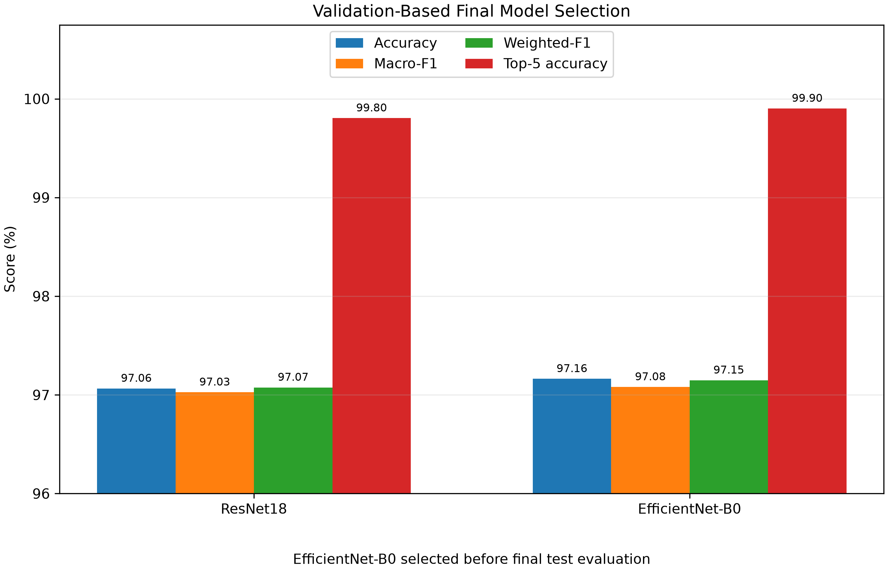
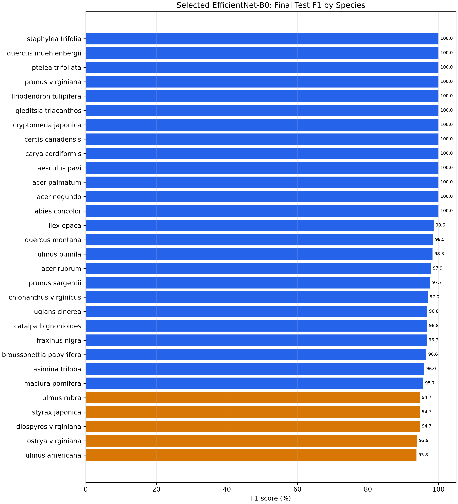

# Part 4: EfficientNet-B0 Final Model

## Protocol status

EfficientNet-B0 is the final model selected in the isolated `reselection_20260727_run1` workflow. ResNet18 and EfficientNet-B0 were first trained and evaluated on the same corrected training and validation splits. The architecture decision was locked using validation metrics before the selected EfficientNet-B0 checkpoint received one final test evaluation.

The final test result is reported once and is not used for further model selection or hyperparameter tuning. Earlier experiment outputs remain preserved separately.

## Model and setup

The implementation uses `EfficientNet_B0_Weights.DEFAULT`, replaces the 1,000-class classifier with a 30-class linear layer, and applies ImageNet normalisation to 224 x 224 RGB inputs.

| Stage | Trainable scope | Trainable parameters | Learning rate | Epochs | Best epoch |
|---|---|---:|---:|---:|---:|
| Frozen head | Classifier | 38,430 | 1e-3 | 5 | 5 |
| Fine-tuning | Final two feature blocks + classifier | 1,167,822 | 3e-5 | 10 | 9 |

The adapted network has 4,045,978 total parameters. The fine-tuning stage starts from the best frozen-head checkpoint. Both stages use seed 42, batch size 16, weight decay `1e-4`, identical corrected splits, and the shared augmentation pipeline.

## Stage results

| Stage | Validation accuracy | Validation Macro-F1 |
|---|---:|---:|
| Frozen head | 94.91% | Not calculated |
| Fine-tuned | **97.16%** | **97.08%** |

The fine-tuned validation metrics are:

| Metric | Score |
|---|---:|
| Accuracy | 97.16% |
| Macro Precision | 97.22% |
| Macro Recall | 97.09% |
| Macro-F1 | 97.08% |
| Weighted-F1 | 97.15% |
| Top-5 Accuracy | 99.90% |

## Validation-based final model selection

| Model | Validation accuracy | Validation Macro-F1 | Validation Weighted-F1 | Top-5 accuracy | Total parameters |
|---|---:|---:|---:|---:|---:|
| ResNet18 | 97.06% | 97.03% | 97.07% | 99.80% | 11.19M |
| EfficientNet-B0 | **97.16%** | **97.08%** | **97.15%** | **99.90%** | **4.05M** |

EfficientNet-B0 was selected before final test evaluation. It leads by 0.10 percentage points in validation accuracy and 0.05 points in validation Macro-F1, and has only 36.15% as many total parameters as ResNet18.

The performance difference is small and is not presented as statistically significant. The model choice follows the declared validation-first decision rule while also favouring the substantially smaller architecture.



## Locked final test result

Selected checkpoint:

```text
reselection_20260727_run1/outputs/efficientnet_b0/finetune/best_model.pt
```

The locked checkpoint was evaluated once on the corrected 1,001-image test split.

| Metric | Score |
|---|---:|
| Accuracy | **97.80%** |
| Macro Precision | 98.01% |
| Macro Recall | 97.97% |
| Macro-F1 | **97.94%** |
| Weighted Precision | 97.91% |
| Weighted Recall | 97.80% |
| Weighted-F1 | **97.81%** |
| Top-5 Accuracy | 99.90% |

The model correctly classifies 979 of 1,001 test images. Test accuracy is 0.64 percentage points above validation accuracy, while test Macro-F1 is 0.86 points above validation Macro-F1. These results support stable held-out performance without changing the model-selection decision.

## Per-class observations

The five lowest final-test F1 scores are:

| Species | Precision | Recall | F1 | Support |
|---|---:|---:|---:|---:|
| `ulmus_americana` | 93.75% | 93.75% | 93.75% | 32 |
| `ostrya_virginiana` | 88.57% | 100.00% | 93.94% | 31 |
| `diospyros_virginiana` | 94.74% | 94.74% | 94.74% | 38 |
| `styrax_japonica` | 90.00% | 100.00% | 94.74% | 36 |
| `ulmus_rubra` | 97.83% | 91.84% | 94.74% | 49 |

`ostrya_virginiana` and `styrax_japonica` have perfect recall but lower precision, indicating that images from other species are sometimes assigned to them. `ulmus_rubra` has high precision but lower recall, so some true examples are assigned elsewhere.



## Reproducibility

Training:

```bash
python part4_efficientnet_b0.py \
  --config reselection_20260727_run1/configs/efficientnet_b0_frozen.yaml

python part4_efficientnet_b0.py \
  --config reselection_20260727_run1/configs/efficientnet_b0_finetune.yaml
```

Validation evaluation remains the default:

```bash
python part4_evaluate_efficientnet_b0.py \
  --config reselection_20260727_run1/configs/efficientnet_b0_finetune.yaml \
  --checkpoint reselection_20260727_run1/outputs/efficientnet_b0/finetune/best_model.pt \
  --output-dir reselection_20260727_run1/outputs/efficientnet_b0/finetune/validation
```

The final test command is recorded for provenance and must not be used for additional tuning:

```bash
python part4_evaluate_efficientnet_b0.py \
  --config reselection_20260727_run1/configs/efficientnet_b0_finetune.yaml \
  --checkpoint reselection_20260727_run1/outputs/efficientnet_b0/finetune/best_model.pt \
  --output-dir reselection_20260727_run1/outputs/efficientnet_b0/finetune/test \
  --split test
```

## Reselection deliverables

- `src/models/efficientnet_b0.py`
- `part4_efficientnet_b0.py`
- `part4_evaluate_efficientnet_b0.py`
- `part4_plot_reselection_results.py`
- `reselection_20260727_run1/configs/efficientnet_b0_frozen.yaml`
- `reselection_20260727_run1/configs/efficientnet_b0_finetune.yaml`
- `report/tables/reselection_efficientnet_b0_experiments.csv`
- `report/tables/reselection_model_validation_comparison.csv`
- `report/tables/reselection_efficientnet_b0_final_test_metrics.csv`
- `report/tables/reselection_efficientnet_b0_test_per_class_metrics.csv`
- `report/figures/reselection_20260727_run1/reselection_finetuning_curves.png`
- `report/figures/reselection_20260727_run1/reselection_validation_model_comparison.png`
- `report/figures/reselection_20260727_run1/reselection_efficientnet_b0_test_per_class_f1.png`

## Limitations

- The architecture comparison uses one fixed split and one seed.
- The validation advantage over ResNet18 is only 0.10 percentage points.
- No statistical uncertainty interval is reported.
- Runtime and energy usage were not measured consistently.
- The final test set must remain locked after this evaluation.
