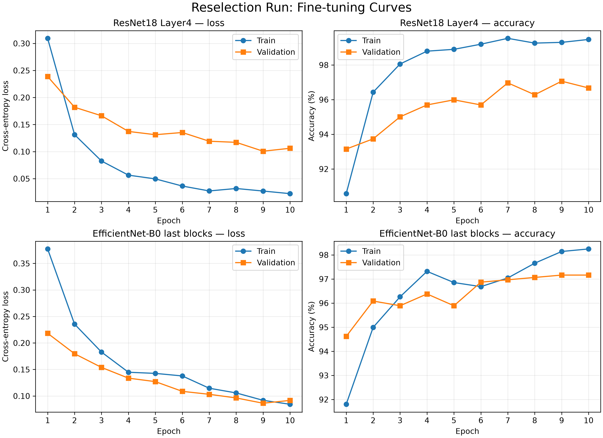

# Part 4: ResNet18 Transfer Learning

## Responsibility and scope

Part 4 implements ResNet18 transfer learning for the 30-class Leafsnap tree-species classification task. The work includes TorchVision model adaptation, classifier replacement, staged checkpoint transfer, trainable-scope control, frozen BatchNorm handling, ImageNet normalisation, MPS support, multi-class evaluation, and reproducible reporting.

The final model-selection workflow is stored separately under `reselection_20260727_run1`. This isolated run preserves earlier experiment artifacts while ensuring that ResNet18 and EfficientNet-B0 are compared using the same corrected split, preprocessing, seed, batch size, weight decay, and fine-tuning learning rate.

## Corrected data and preprocessing

| Split | Images |
|---|---:|
| Training | 4,734 |
| Validation | 1,022 |
| Test | 1,001 |
| **Total** | **6,757** |

The corrected dataset contains 30 classes. Part 4 reuses the relocked Part 2 split files without regeneration. Training and validation use 224 x 224 RGB inputs, with the shared training augmentation and deterministic validation preprocessing. ImageNet normalisation is applied:

```text
mean = [0.485, 0.456, 0.406]
std  = [0.229, 0.224, 0.225]
```

## Model implementation

The model is initialised with `torchvision.models.ResNet18_Weights.DEFAULT`. Its original 1,000-class fully connected layer is replaced with a 30-class layer.

The implementation supports three trainable scopes:

- `head`: train only the final classifier.
- `layer4`: train the final residual block and classifier.
- `all`: fine-tune the complete network.

The adapted model contains 11,191,902 parameters. The frozen-head stage has 15,390 trainable parameters, while Layer4 fine-tuning has 8,409,118. Frozen BatchNorm modules remain in evaluation mode so their running statistics do not change unintentionally.

## Isolated reselection run

All reselection stages use seed 42, batch size 16, weight decay `1e-4`, ImageNet normalisation, identical augmentation, and the corrected split files.

| Stage | Scope | Learning rate | Epochs | Best epoch | Validation accuracy | Validation Macro-F1 |
|---|---|---:|---:|---:|---:|---:|
| Frozen head | Head only | 1e-3 | 5 | 4 | 89.73% | Not calculated |
| Layer4 fine-tuning | Layer4 + head | 3e-5 | 10 | 9 | **97.06%** | **97.03%** |

The Layer4 stage starts from:

```text
reselection_20260727_run1/outputs/resnet18/frozen/best_model.pt
```

Its best checkpoint is:

```text
reselection_20260727_run1/outputs/resnet18/layer4/best_model.pt
```

The final Layer4 validation metrics are:

| Metric | Score |
|---|---:|
| Accuracy | 97.06% |
| Macro Precision | 97.41% |
| Macro Recall | 96.90% |
| Macro-F1 | 97.03% |
| Weighted-F1 | 97.07% |
| Top-5 Accuracy | 99.80% |

## Role in final model selection

ResNet18 was treated as a candidate architecture, not as the automatically preferred final model. The fine-tuned checkpoint was compared with the independently trained EfficientNet-B0 checkpoint using validation metrics only.

| Model | Validation accuracy | Validation Macro-F1 | Total parameters |
|---|---:|---:|---:|
| ResNet18 | 97.06% | 97.03% | 11.19M |
| EfficientNet-B0 | **97.16%** | **97.08%** | **4.05M** |

EfficientNet-B0 was selected because it achieved slightly higher validation accuracy and Macro-F1 while using only 36.15% as many total parameters. ResNet18 was therefore not evaluated on the test set within the isolated reselection workflow.

The 0.10 percentage-point validation difference is small and is not evidence of statistical significance. The selection is a deterministic decision under the declared single-split, single-seed protocol.

## Training behaviour

The fine-tuned ResNet18 reaches 99.30% training accuracy and 97.06% validation accuracy at epoch 9. Validation loss is also lowest at epoch 9. The training-validation gap indicates mild overfitting, but validation performance remains high and stable enough for comparison.



## Reproducibility

The isolated ResNet18 stages are reproduced with:

```bash
python part4_resnet18.py \
  --config reselection_20260727_run1/configs/resnet18_frozen.yaml

python part4_resnet18.py \
  --config reselection_20260727_run1/configs/resnet18_layer4.yaml
```

Validation evaluation:

```bash
python part4_evaluate_resnet18.py \
  --config reselection_20260727_run1/configs/resnet18_layer4.yaml \
  --checkpoint reselection_20260727_run1/outputs/resnet18/layer4/best_model.pt \
  --output-dir reselection_20260727_run1/outputs/resnet18/layer4/validation
```

Tracked reselection tables and figures can be rebuilt from saved outputs without training or dataset evaluation:

```bash
python part4_plot_reselection_results.py
```

## Reselection deliverables

- `reselection_20260727_run1/configs/resnet18_frozen.yaml`
- `reselection_20260727_run1/configs/resnet18_layer4.yaml`
- `report/tables/reselection_resnet18_experiments.csv`
- `report/tables/reselection_model_validation_comparison.csv`
- `report/figures/reselection_20260727_run1/reselection_finetuning_curves.png`
- `report/figures/reselection_20260727_run1/reselection_validation_model_comparison.png`

Earlier ResNet18 test artifacts remain available for audit but are not used as the final reselection result.

## Limitations

- Only one fixed split and one seed are used.
- The validation difference between the two architectures is small.
- Runtime and energy usage were not captured consistently.
- Laboratory and field results are not reported separately.
- The final test set must not be reused for further model or hyperparameter selection.
